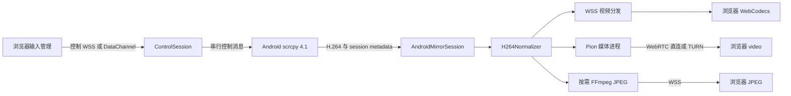

# Android 浏览器远程操控开发方案

日期：2026-09-07  
状态：R1 核心与 R3 JPEG 回退已实现；R2 WebRTC helper 仍需带真实设备/TURN 的专项验收。
适用项目：DuoCLI 当前 Electron 主进程、桌面 Android Pane、mobile/client 浏览器客户端。

## 1. 交付目标与已确定的决策

用户从远程 Safari 打开 DuoCLI 后，能够持续看到 Android 手机画面，准确点按、拖动、滚动、输入中文；网络或视频能力变化时能恢复，不需要用户手动刷新页面猜测故障。

本方案将工作拆为三个可独立验收的版本：

| 版本 | 交付 | 默认视频 | 默认控制 |
| --- | --- | --- | --- |
| R1 | Safari 兼容修复、准确触控、可靠回退、诊断 | 修复后的 H.264 / WSS / WebCodecs | 独立控制 WSS |
| R2 | 公网 WebRTC、TURN、播放通道切换 | WebRTC；失败使用 R1 通道 | 先用 WSS；DataChannel 通过专项验收后启用 |
| R3 | 连续 JPEG、画质档位、长时间稳定性、发布完善 | 自动选路 | 已验证的 DataChannel 或 WSS |

确定采用以下实现边界：

- 采集复用 scrcpy，主机负责一次采集、多订阅者分发；不按浏览器启动一套手机编码器。
- R1 固定并验证 scrcpy 4.1 运行时；不默认修改 Android 服务端。
- R2 采用 Go / Pion v4 独立媒体进程，具体补丁版本在技术验证通过后锁定；不在 Electron 主进程内引入原生 WebRTC ABI 依赖。
- JPEG 连续回退使用按需启动的 FFmpeg 解码进程；sharp 只用于静态图片处理，不能承担 H.264 解码。
- 现有 Cloudflare Tunnel 继续提供页面、API、WSS 和 WebRTC 信令；WebRTC 媒体单独走 ICE / TURN。
- 首个完整发布环境为 macOS arm64 主机；远端验收 Mac Safari、iPhone Safari、iPad Safari、Chrome。Windows / Linux 媒体 helper 打包单独列为后续平台验收，不以代码可编译代替可用。
- Android 首版只处理默认实体显示屏，保持 scrcpy 默认的完整画面和方向；自定义裁剪、虚拟显示屏、任意画面旋转不进入本次实现。
- 首版不提供音频、录制、多人同时操控、浏览器软件 H.264 解码器或 HLS 播放。

R1 不依赖 TURN 账号，可以先开发和交付。TURN 服务商、区域和凭据不确定，不阻塞 R1，也不阻塞 R2 的本地原型。

## 2. 现状证据与需要纠正的假设

以下是代码审查结果，不等同于已经复现用户当次 Safari 故障。

| 编号 | 证据位置 | 已确认问题 | 开发处理 |
| --- | --- | --- | --- |
| F01 | mobile/client/app.js 的 ensureAndroidMirror / onError | 所有客户端错误都显示“浏览器不支持” | 保留原因码、原始错误、故障阶段 |
| F02 | mobile/client/android-mirror-client.js 的 decodePacket | CONFIG 标志被当成关键帧，参数包独立送入解码器 | 按实际 AU / SPS / PPS / IDR 组包 |
| F03 | src/main/android-mirror.ts 的 packetsForNewSubscriber | 回放旧 IDR 后直接接当前 delta，缺中间依赖 | 新订阅等待新的 IDR，禁止不完整回放 |
| F04 | remote-server.ts 的 sendBinary；前端 decodeQueueSize 判断 | 拥塞时无同步状态地丢压缩帧 | 丢帧后等待 IDR；媒体连接过期则重建 |
| F05 | app.js 的 startAndroidFallback | 1500ms 轮询，JPEG quality=55、scale=0.45 | R1 单飞轮询；R3 共享连续 JPEG |
| F06 | app.js 的 mirrorSurfaceSize / imgToDevice | img.width 优先于 naturalWidth，且输出未统一映射到控制坐标 | 归一化画面坐标与服务端映射 |
| F07 | app.js 的 onStatus(ready) | 服务端就绪就停截图，浏览器首帧未必成功 | 首帧真正呈现后切换 |
| F08 | app.js 的 sendTextToDevice；客户端 onAck 未接入 | 发送与执行反馈混淆，HTTP 错误被忽略 | 输入 ACK / 超时 / 失败分层 |
| F09 | remote-server.ts 的 input-text | 输入法恢复硬编码为搜狗 | scrcpy 剪贴板粘贴；辅助 IME 记录原值恢复 |
| F10 | app.js 的 visibilitychange / pageshow | 恢复逻辑针对终端，没有 Android 会话专用恢复 | 独立 Android 生命周期 |

已读取本机 `scrcpy --version`，结果为 4.1，并核对上游对应标签：

- 4.1 视频协议将 session、config、key 分别编码，不应套用旧版本包结构。当前解析器的基本标志布局与 4.1 相符；问题集中在下游消费和恢复逻辑。[上游 Streamer](https://raw.githubusercontent.com/Genymobile/scrcpy/v4.1/server/src/main/java/com/genymobile/scrcpy/device/Streamer.java)
- 4.1 有 `RESET_VIDEO`，没有在该控制消息集合中提供动态调码率指令；前者是视频重置，不是轻量的“立即请求 IDR”。[上游 ControlMessage](https://raw.githubusercontent.com/Genymobile/scrcpy/v4.1/server/src/main/java/com/genymobile/scrcpy/control/ControlMessage.java)
- 默认 I 帧间隔为 10 秒，codec options 可覆盖编码配置。R1 将 1 秒作为待真机验证的初始间隔。[上游 SurfaceEncoder](https://raw.githubusercontent.com/Genymobile/scrcpy/v4.1/server/src/main/java/com/genymobile/scrcpy/video/SurfaceEncoder.java)
- 上游以 ACTION_UP 更新内部触点释放状态；单独发送 ACTION_CANCEL 不能假设同时清理所有内部触点，必须列入设备验证。[上游 Controller](https://raw.githubusercontent.com/Genymobile/scrcpy/v4.1/server/src/main/java/com/genymobile/scrcpy/control/Controller.java)

Safari 16.4 开始提供 WebCodecs 视频 API，但实际编码支持仍需运行时检测。HTTPS、安全上下文、API 存在、配置可用、首帧输出是不同检查层。[WebKit](https://webkit.org/blog/13966/webkit-features-in-safari-16-4/)、[WebCodecs](https://www.w3.org/TR/webcodecs/)

## 3. 架构与模块职责



`AndroidMirrorSession` 是每台设备的唯一采集拥有者。多个浏览器及桌面 Pane 共享源，但各自有播放状态、缓冲预算和控制权限。一个客户端的解码失败不得停止手机采集或影响另一个正常客户端。

拟改动文件和职责如下；这些是规划路径，不表示文件已经存在。

| 路径 | 职责 / 改动 |
| --- | --- |
| src/main/android-mirror.ts | 保留设备会话管理、ADB 生命周期；接入规范化视频和输入管理 |
| src/main/android-h264.ts | Annex-B NAL / AU 检查、SPS/PPS 缓存、IDR 规范化、编码描述 |
| src/main/android-control.ts | 控制权、序号、触点、输入队列、键盘、剪贴板设备消息解析 |
| src/main/android-mirror-protocol.ts | V2 消息校验、DVM2 编解包、错误码 |
| src/main/android-mirror-routes.ts | V2 API / WS 路由、订阅管理、客户端配额；由 remote-server.ts 注册 |
| src/main/android-media-helper.ts | Pion 子进程启动、IPC、peer 绑定、异常恢复 |
| src/main/android-jpeg.ts | FFmpeg / ADB 两类图片来源、共享缓存、单飞与客户端限速 |
| src/renderer/android/core.ts | 桌面与浏览器共享的播放状态机、能力检测、输入和几何转换 |
| src/renderer/android/webcodecs.ts | WebCodecs sink，与 DOM 工具栏解耦 |
| src/renderer/android/webrtc.ts | PeerConnection、video sink、信令和 getStats |
| src/renderer/android/browser-entry.ts | 输出兼容当前 globalThis.DuoAndroidMirrorClient 的浏览器入口 |
| src/renderer/android-mirror-client.ts | 渐进改成共享 core 的桌面适配器 |
| mobile/client/android-mirror-client.js | 由 browser-entry 构建的 IIFE；避免维护两套解码算法 |
| mobile/client/app.js / index.html / style.css | 保留页面组织，接入 video/canvas/img 三类 surface 和状态 UI |
| src/renderer/app.ts / src/main/index.ts | 桌面 Pane、旧 Android IPC 接入同一控制规则 |
| native/android-media/ | Go module、Pion peer、RTP、反馈、IPC；R2 新增 |
| scripts/after-pack.mjs / package.json | helper 资源、版本清单、前端共享模块构建和测试入口 |
| tests/fixtures/android/ | 合成或专用测试画面采集的协议样本及 metadata |

不把共享 TypeScript 强行放到 src/shared 后直接跨 rootDir 引用：当前 main 的 rootDir 为 src/main。浏览器共享源放在 renderer/android，经 esbuild 构建；主进程协议定义由协议一致性测试约束，保持现有 dist/main 路径稳定。

## 4. 会话与状态模型

### 4.1 标识符及其生命周期

| 字段 | 生成方 | 变化时机 |
| --- | --- | --- |
| sessionId | Node | 每次设备逻辑会话建立；无订阅超过 30 秒后销毁 |
| clientId | Node | 每个已认证客户端实例 |
| subscriptionId | Node | 客户端对一台设备的一次订阅 |
| captureGeneration | Node，uint32 | 每个新的 scrcpy video session，包括同尺寸编码重置 |
| geometryVersion | Node，uint32 | 视频坐标尺寸、显示屏或方向映射失效时；无法确认映射连续时也递增 |
| configVersion | Node，uint32 | SPS/PPS 或编码描述变化；相同参数重复发送不递增 |
| mediaEpoch | Node，uint32 | 单个订阅切换 / 重建媒体传输时 |
| controlEpoch | Node，uint32 | 授予控制、控制通道迁移或控制重连时 |
| seq | 客户端，安全整数 | 每个 controlEpoch 内递增，服务端不可因换 socket 而遗忘 |

设备重启、几何变更、旧 socket 和异步图片回调都必须通过这些标识过滤。计数即将回绕时新建相应会话，不能静默复用值。

### 4.2 三组独立状态

```ts
type CaptureState = 'idle' | 'starting' | 'ready' | 'restarting' | 'offline' | 'error';
type PlaybackState = 'probing' | 'connecting' | 'awaiting-keyframe'
  | 'playing' | 'recovering' | 'suspended' | 'unavailable';
type ControlState = 'view-only' | 'claiming' | 'ready' | 'recovering' | 'unavailable';
type VideoTransport = 'webrtc' | 'webcodecs-ws' | 'jpeg-ws' | 'screenshot-http';
```

`capture=ready` 只表示主机收到有效视频 metadata 且控制 socket 状态已知。`playback=playing` 只在浏览器成功呈现至少一帧后进入。控制是否可用不由 hasFrame 或 VideoDecoder 是否存在决定。

触控额外要求：客户端当前显示画面的 geometryVersion 与服务端相符，并且显示的不是超过容忍时长的故障冻结帧。正常静止画面在源健康、几何仍有效时可以继续控制。

### 4.3 状态转换的规则

| 事件 | 处理 |
| --- | --- |
| subscribe | 显示“连接中”；允许一张初始图片占位；开始采集或复用设备源 |
| capture ready | 更新 metadata，不立即隐藏图片 |
| 首帧呈现 | 设置 playing；切换可见 surface；停止低级回退订阅 |
| 单次解码失败 | 当前 sink 进入 awaiting-keyframe；局部重建；累计故障计数 |
| 10 秒内 3 次解码失败或 2 秒首帧超时 | 降级到下一个已具备能力的通道，并记录阶段和原因 |
| 设备启动中 | 单独给 10 秒采集启动预算；不要把冷启动计入浏览器 2 秒解码预算 |
| WebRTC 5 秒未建成 / 失败 | 启用 WSS 视频；健康的既有视频在探测期间保持显示 |
| 几何变化 | 结束旧手势，关闭旧几何的输入；等新画面呈现并确认几何后恢复 |
| 切换视频通道 | 仅更改 mediaEpoch；几何没变化、控制通道健康时无需迁移控制 |
| 页面隐藏 | 结束手势、释放控制、暂停媒体订阅；保留低流量信令至宽限期结束 |
| 页面恢复 | 探测控制连接、重新订阅媒体、从 IDR 开始，不回放后台积压 |
| WS / ICE 断开 | 立即停止新增手势；服务端到期清理触点；保留最后画面并显示恢复状态 |

升回更高质量通道：健康运行 30 秒后最多探测一次；同类失败后 60 秒冷却；明确的 capability 不支持在本次页面会话内不循环尝试。手势进行中不主动升级通道。只有新通道成功出帧且短期稳定后切换；静态屏幕不能要求必须连续产生固定数量帧才视为稳定。

## 5. V2 对外协议

R1 在独立路径提供 V2，保留旧 `/android-ws` 和 DVM1 适配。旧协议适配器也必须使用修复后的 H.264 组包，并接入同一控制权仲裁，不能旁路。

### 5.1 HTTP 入口

全部使用现有 Bearer 认证；返回 `Cache-Control: no-store`。

| 方法 / 路径 | 请求 | 返回 / 含义 |
| --- | --- | --- |
| GET /api/android/capabilities | 无 | protocolVersions、runtimeVersion、helper 能力、TURN 是否配置；不返回长期密钥 |
| POST /api/android/sessions | deviceId、clientCapabilities、videoPreference | sessionId、clientId、subscriptionId、可选媒体、socketTickets |
| POST /api/android/sessions/:id/socket-tickets | subscriptionId、用途 control/video | 用于重连的短期一次性 WS ticket |
| POST /api/android/sessions/:id/unsubscribe | subscriptionId | 释放订阅；WS 断开后也有服务端到期回收 |
| GET /api/android/sessions/:id/screenshot | subscriptionId、qualityPreset | JPEG 二进制与会话/几何响应头 |

示例会话请求：

```json
{
  "deviceId": "selected-device",
  "videoPreference": "auto",
  "clientCapabilities": {
    "secureContext": true,
    "webCodecs": true,
    "webRtc": true,
    "requestVideoFrameCallback": true,
    "visibility": "visible"
  }
}
```

以上只是能力存在性；具体 H.264 profile / level 得到 metadata 后再验证。不要通过 userAgent 的 Safari 字符串决定能否播放。

`socketTickets` 分 control/video 用途，30 秒过期，绑定 clientId、subscriptionId、sessionId。浏览器连接 `/android-control-ws` 或 `/android-video-ws` 后用首条 JSON 认证，5 秒未认证则关闭。长期登录 token 不新增到媒体 URL。V1 兼容认证不在 R1 做无关改造。

### 5.2 控制 WSS 消息

公共字段：`v:2`、`type`、`sessionId`、`subscriptionId`。需要响应的命令带 `requestId`；服务端校验字段类型、长度和会话绑定。

| type | 方向 | 关键字段 |
| --- | --- | --- |
| session.state | S → C | capture、playbackTransport、control、error |
| video.meta | S → C | captureGeneration、geometryVersion、configVersion、codec、width、height、displayId |
| video.subscribe | C → S | preference、mediaEpoch；具体 epoch 由服务端返回确认 |
| video.resync | C → S | mediaEpoch、reason、lastFrameId；服务端去重限频 |
| video.feedback | C → S | mediaEpoch、generation、receivedFrameId、presentedFrameId、decodeQueue、receiveToPresentMs、visibility |
| control.claim | C → S | takeover:false/true；默认不抢占 |
| control.granted | S → C | controlEpoch、ownerClientId、leaseMs、transport |
| control.owner | S → C | ownerClientId、isController；所有广播字段一致 |
| control.input | C → S | controlEpoch、seq、geometryVersion、input |
| control.ack | S → C | controlEpoch、seq、status、stage、error |
| control.release | C → S | controlEpoch、reason |
| control.renew | C → S | controlEpoch |
| rtc.offer / rtc.answer | 双向 | negotiationId、mediaEpoch、sdp |
| rtc.ice | 双向 | negotiationId、mediaEpoch、candidate 或结束标记 |
| ping / pong | 双向 | pingId、clientSentMs；原样回显用于 RTT |

SDP 最大 64 KiB；单条 control JSON 最大 64 KiB；普通输入文本上限 16 KiB UTF-8；超限返回明确错误，不能触发主进程无界内存分配。

输入示例：

```json
{
  "v": 2,
  "type": "control.input",
  "sessionId": "s-1",
  "subscriptionId": "sub-1",
  "controlEpoch": 4,
  "seq": 31,
  "geometryVersion": 8,
  "input": {
    "type": "touch",
    "action": "down",
    "pointerId": 7,
    "x": 0.52,
    "y": 0.73,
    "pressure": 1
  }
}
```

ACK 示例：

```json
{
  "v": 2,
  "type": "control.ack",
  "sessionId": "s-1",
  "subscriptionId": "sub-1",
  "controlEpoch": 4,
  "seq": 31,
  "status": "ok",
  "stage": "written-to-device"
}
```

`written-to-device` 仅表示写入 scrcpy 控制 socket，不证明目标应用处理成功。剪贴板设备回执使用 `device-ack`，也不证明输入框已经出现文本。普通触控成功回执不弹 Toast。

### 5.3 DVM2 视频消息

每个 WebSocket 二进制消息对应一个完整 H.264 access unit 或一张 JPEG，不拆成多个应用层 WS 消息。头部 56 字节，网络字节序。

| 偏移 | 长度 | 字段 |
| --- | --- | --- |
| 0 | 4 | magic = ASCII DVM2 |
| 4 | 1 | version = 2 |
| 5 | 1 | kind：1=H.264 Annex-B AU；2=JPEG |
| 6 | 2 | flags：bit0=IDR；bit1=discontinuity，其余保留 |
| 8 | 4 | captureGeneration |
| 12 | 4 | geometryVersion |
| 16 | 4 | configVersion |
| 20 | 4 | frameId |
| 24 | 8 | ptsUs；JPEG 无可追溯源 PTS 时为 0 |
| 32 | 8 | hostFrameReceivedUs；JPEG 为主机获得 JPEG 的时间 |
| 40 | 2 | width |
| 42 | 2 | height |
| 44 | 4 | payloadLength |
| 48 | 4 | mediaEpoch |
| 52 | 4 | reserved = 0 |

`frameId` 在同一 captureGeneration、kind 内递增；H.264 与 JPEG 不能用 frameId 互相比较。媒体分发器按订阅填 mediaEpoch。Node → helper 的源输入使用 mediaEpoch=0，helper 自己维护 peer 的播放代次。

客户端严格校验消息总长为 `56 + payloadLength`。H.264 payload 硬上限 16 MiB，JPEG 4 MiB；这些是异常保护上限，不是允许的实时缓冲量。64 位值在内部使用 BigInt，转换为解码时间前检查安全范围；不要把绝对手机时钟强制转成无界 Number。

CONFIG 包不作为 DVM2 视频帧发送。服务端保留 SPS/PPS，并将缺少的必要参数加到 IDR AU 前；每个 IDR 都可在当前 config 下独立启动解码。

metadata 在控制 WSS、视频在另一条 WSS，二者没有跨连接顺序保证。客户端收到未知版本的帧先请求 metadata，最多暂存 2 个 AU；超限丢弃并等待下个 IDR，不猜尺寸或沿用旧配置。

### 5.4 结构化错误

```ts
interface MirrorError {
  code: string;
  stage: 'auth' | 'capture' | 'transport' | 'decode' | 'render' | 'control';
  retryable: boolean;
  message: string;
  detail?: string;
}
```

最少实现：`AUTH_EXPIRED`、`PROTOCOL_UNSUPPORTED`、`INSECURE_CONTEXT`、`WEBCODECS_UNAVAILABLE`、`CODEC_UNSUPPORTED`、`DECODE_FAILED`、`FIRST_FRAME_TIMEOUT`、`PLAYBACK_BLOCKED`、`MEDIA_CONGESTED`、`ICE_FAILED`、`TURN_UNAVAILABLE`、`DEVICE_OFFLINE`、`SCRCPY_START_FAILED`、`GEOMETRY_STALE`、`CONTROL_NOT_OWNER`、`CONTROL_EPOCH_STALE`、`CONTROL_OVERLOADED`、`INPUT_RESULT_UNKNOWN`。

网络错误显示“视频连接中断，正在恢复”；真实能力缺失显示“已启用兼容画面”。原始异常出现在诊断面板，不在每一帧失败时重复弹通知。

## 6. R1 视频实现细节

### 6.1 H.264 规范化

1. 用真实 4.1 stream fixture 验证拆包，覆盖 TCP 分片、粘包、session marker、config 和 IDR 分离。
2. 以 scrcpy media packet 的 AU 为处理单位，不把单个 NAL 误当一帧；扫描 3/4 字节 Annex-B 起始码，识别 SPS(7)、PPS(8)、IDR(5)。
3. config packet 只更新参数缓存。参数字节或对应标识变化时 configVersion 递增，清空旧解码接续状态。
4. 真实 IDR 前补齐当前匹配的 SPS/PPS，避免重复前缀。编码参数变化后不得拼接上一代 IDR。
5. 从实际 SPS 生成 codec string，不用默认 `avc1.42E01E` 掩盖缺失参数。
6. 解析器发现损坏或无法解释的 AU 时报告错误并等待新的有效参数和 IDR，不靠持续捕获异常重试每帧。

这是 Annex-B WebCodecs 对 key chunk 的要求：完整 IDR 画面和解码所需参数必须可获得。[H.264 WebCodecs 注册说明](https://www.w3.org/TR/webcodecs-avc-codec-registration/)

### 6.2 浏览器解码

流程：能力检查 → 收到实际 codec → `isConfigSupported()` → configure → 等待 IDR → decode → 绘制成功 → playing。

- `optimizeForLatency:true`；先检测并使用 `hardwareAcceleration:'no-preference'`，以实际输出确认，不把 prefer-hardware 当作兼容性前提。
- `isConfigSupported()` 成功仍可能在 decode 时失败，异步 decoder error 必须保留并进入恢复状态。
- 同一 sink 同时只存在一个有效 decoder generation；旧 output callback 只关闭 frame，不更新 UI。
- 所有 VideoFrame 在成功、失败、隐藏、丢弃路径都调用 close。
- 不在每次 meta 中重复赋值 canvas.width / height；只有实际尺寸变化才修改，避免无意清空画面。
- 解码输出只保留最新待绘制 frame；requestAnimationFrame 消费并关闭被替换的 frame。
- 只绘制当前实际显示的预览或全屏 surface。首次打开全屏先复制最后有效画面，再切渲染目标，静止屏幕也不应黑屏。
- 如果规范 Annex-B 在特定已支持配置的 Safari 上仍失败，R1 技术验证中测试 AVCC + avcC 配置路径；若证实必要，再增加封装适配，并以真实 fixture 约束。不能只依据浏览器名称默认转换。

### 6.3 编码启动参数

R1 初始配置：长边 800、最高 30fps、1.5Mbps、H.264。通过 scrcpy 的 `video_codec_options` 尝试 `i-frame-interval=1`。baseline / 无 B 帧属于兼容性验证项，按实际编码器接受情况设置；不要把一个设备支持的 profile 参数推广成所有手机固定值。

每台设备记录实际 SPS codec、实际尺寸、关键帧间隔、参数回退情况。编码器拒绝可选参数时按预定候选重试一次，随后使用已验证配置并展示降级原因，不能无限循环。

新订阅默认等待下一有效 IDR，期间显示占位截图。等待超过 1.5 秒且采集健康时可请求视频重置。4.1 RESET_VIDEO 以设备为单位合并，最多每 5 秒一次；它会影响该设备所有观众，慢观众不能无限触发。

若重复重置仍无法满足恢复目标，将“扩展 scrcpy 轻量请求 IDR”单独列为决策任务；不把 RESET_VIDEO 宣称为无扰动恢复。

### 6.4 有界缓冲和恢复

- 服务端每个订阅者记录最新源帧、发送帧、客户端呈现反馈；反馈周期 500ms。
- 正常发送队列预算 150ms。按近期实际码率估算字节预算，至少容纳一个合法 IDR；再以反馈检查下游隧道积压。
- 单次超预算：该订阅暂停发 delta，进入 waiting-IDR。不能删除已经交给 TCP 的字节。
- 已进入 WS / 隧道的媒体超过 500ms 预算并持续 2 秒：关闭该媒体 socket、递增 mediaEpoch、重连到当前源；控制 WSS 保持。
- 客户端 decodeQueueSize 超过 3 时，不是随意跳过某个 delta 后继续解码；重置当前解码代次、等待下一 IDR。
- 播放反馈沉默先检查页面可见性和连接健康。源帧没有增长不等同于客户端落后；只有源在增长而显示落后才按卡流处理。
- 持续拥塞只影响对应客户端；重连需要退避，避免把低带宽变成无限重连风暴。

## 7. 输入、坐标和控制权

### 7.1 坐标转换合同

渲染源尺寸分别取：canvas 的内部 width/height、video.videoWidth/videoHeight、img.naturalWidth/naturalHeight。布局盒尺寸只用于求实际显示区域。

```text
s = min(containerWidth / sourceWidth, containerHeight / sourceHeight)
renderWidth  = sourceWidth  * s
renderHeight = sourceHeight * s
left = rect.left + (containerWidth  - renderWidth)  / 2
top  = rect.top  + (containerHeight - renderHeight) / 2
u = (clientX - left) / renderWidth
v = (clientY - top)  / renderHeight
```

按下发生在黑边内则忽略；已捕获手势移出画面时将 u/v 限制到 [0,1] 以完成抬起。节点不额外加 padding/border；若设计需要，测量内部 content box。

scrcpy 控制路径：`x=round(u*(videoWidth-1))`、`y=round(v*(videoHeight-1))`，同时发送匹配的视频坐标宽高，让 scrcpy 自己映射到设备。不要把物理屏幕坐标又配上缩小的视频宽高。

ADB 应急路径：使用该次全屏截图对应的原始显示尺寸和方向映射，不能沿用 0.45 缩略图宽高，也不能假设未旋转的 `wm size` 就是当前坐标系。R1 限默认显示屏、无裁剪；获取不到可信方向时只允许观看并提示重新取帧。

每个可交互 surface 保存自己最后呈现的 geometryVersion，而不是读取“最新收到的 metadata”冒充已显示画面。几何变化后旧画面继续占位时，不接受新点按。

### 7.2 输入顺序和队列

- pointerdown：本地触点反馈；持有控制权才发送；未持有时进入 claiming，首次获权完成后再要求一次明确点按，避免延迟执行原来的触点。
- pointermove：按 pointerId 合并，最高 60Hz；同一事件循环内最新值覆盖未发送的旧值。
- pointerup：先发送该 pointer 必要的最终位置，然后 up；其它 pointer 的 move 不被误删。
- pointercancel / lostpointercapture / blur：进入 releaseAll 过程，停止继续收集手势。
- 服务端使用有界串行输入队列，最多 128 项；合并相邻同 pointer 的 move，不能跨 down/up 边界合并。
- 一次 tap 的 down/up、一次快捷键的 down/up 是队列中的原子批次，禁止其它请求穿插。
- 达到硬限制时拒绝新增手势并优先结束现有触点；不得无限追加 Promise 链。

### 7.3 幂等与回执

- 服务端按 clientId + controlEpoch 记录 seq 高水位和最近 256 个命令结果。
- 重复 seq 返回已知结果，不重复执行 tap、文本和按键。已过缓存但小于高水位返回 stale，仍不执行。
- touch 不在网络重连后自动重放。文本结果未知时保留输入内容并提示“结果未确认”，不能自动再粘贴一遍。
- 前端 ACK 观察超时初值 1 秒，结合 RTT 调整；超时只代表结果未知，不代表必定未执行。
- 服务端撤销控制权时，在每条队列命令实际执行前再次校验 controlEpoch，清理旧主人的待执行动作。

### 7.4 控制租约与释放

首个客户端可自动取得空闲设备的控制权；其它客户端默认观看，点击“接管”才发送 takeover=true。删除当前每次 pointerdown 无条件 claim 的行为。

控制租约 6 秒，2 秒续租；手势按住期间每 500ms 发送存活信息。手势失联 2 秒则服务端主动释放，即使 WS 尚未收到 close。正常长按在存活信号持续时不超时。

releaseAll 必须同时解决 Android 当前手势和 scrcpy 内部触点表：优先验证发送 CANCEL 后为已跟踪 pointer 发送必要的 UP 清理；以专用测试页面确认没有误点或幽灵触点。若 4.1 不能满足，则实施一个有独立版本标记的最小服务端触点清理补丁，该项是输入验收阻断项，不能仅以 socket 已关闭视为通过。

控制权转移顺序固定：冻结旧输入 → 结束旧触点 → 清理旧队列 → 更新 controlEpoch/owner → 广播 → 新客户端开始输入。

### 7.5 中文、粘贴与快捷键

- 中文和长文本默认使用 scrcpy SET_CLIPBOARD + paste，并解析设备 clipboard ACK。
- 输入框收到明确传输失败时保留文本；只在收到预期回执后清空编辑框。设备 ACK 仍不等同于目标应用成功粘贴。
- 浏览器正在 IME composition 时不把 Enter 当发送，等 compositionend。
- 短键盘动作映射 Android keycode；返回、主页、最近任务发送成原子按下/抬起批次。
- 必须使用辅助输入法时，先查询并保存当前默认 IME，在 finally 中恢复原值；辅助 IME 缺失时给出明确失败，不能切回硬编码搜狗。
- 自动双向剪贴板同步不在范围内。粘贴会写入手机剪贴板，在输入工具说明中告知一次。

## 8. R2 WebRTC 实施合同

### 8.1 helper 的职责与 IPC

一个 DuoCLI 进程按需启动一个 Go helper，管理多个 device source 和 peer。Node 继续拥有 ADB、身份认证、控制权和 scrcpy 控制 socket。

helper 使用两条仅 loopback 可访问的本地 TCP 通道，分别传控制和媒体，端口动态分配。启动握手通过父子进程管道交换随机凭据与端口；认证失败关闭连接。日志写 stderr，stdout 仅用于启动握手，避免日志污染协议。

控制消息采用 4 字节长度 + UTF-8 JSON，带 requestId。最少实现：hello、source.add/remove、peer.create/close、peer.answer、peer.ice、input.received、input.result、media.feedback、source.resync。

媒体记录采用 sourceId(uint32) + packetLength(uint32) + DVM2 packet。每源有界队列；helper 卡住时只暂停该媒体输出并恢复 WSS，不阻塞手机采集和输入。

helper 崩溃：标记所有对应 RTC peer 失败，客户端使用 WSS；最多指数退避重启 3 次 / 5 分钟。父进程退出或失联后 helper 自动退出，不留下后台进程。

### 8.2 信令流程

1. Node 确认真实视频编码参数，并把当前 source 描述交给 helper。
2. helper 建立 sendonly 视频 transceiver，可选创建 reliable ordered 的 `duocli-control-v2` DataChannel。
3. helper 产生 offer，经认证控制 WSS 转发浏览器。
4. 浏览器 setRemoteDescription、createAnswer、setLocalDescription，把 answer 返回。
5. 两端交换 trickle ICE；远端描述尚未完成时将 candidate 暂存，按 negotiationId 归属处理。
6. ontrack 将 MediaStream 绑定到 video；使用 muted、autoplay、playsInline。
7. video.play 被拒绝时显示可点击“开始画面”控件，不误报编解码器不支持。
8. 首次实际呈现后上报播放成功，切换旧 surface。

首帧优先通过 requestVideoFrameCallback 确认；无该 API 时用 loadeddata、readyState、尺寸和后续渲染时机作为较弱观测，诊断中标明精度。

### 8.3 RTP / 编码约束

使用 Pion v4 的 RTP / RTCP 能力。H.264 AU 采用经过验证的 packetizer，处理单 NAL / FU-A 分片、marker 位、序号、SSRC 和 90kHz 时钟，初始 MTU 约 1200 字节，允许按路径调整。[Pion API](https://pkg.go.dev/github.com/pion/webrtc/v4)、[官方 H.264 示例](https://github.com/pion/example-webrtc-applications/tree/main/play-from-disk-h264)

采用按实际 PTS 生成 RTP timestamp 的路径：`base + round((ptsUs-firstPtsUs)*90000/1000000)`，按 uint32 回绕；不固定每帧 33ms，不等待下一帧才发送当前帧。视频重置时保持传输时间轴合理连续，必要时新建媒体代次；源的时间戳倒退不能直接写入旧 RTP 时钟。

SDP H.264 profile-level-id 与实际编码匹配，packetization-mode=1；不只改 SDP 文本就宣称支持某 profile。测试无 B 帧低延迟编码；编码器无法产生协商兼容的流时，返回 CODEC_UNSUPPORTED 并走已验证备用路径。

配置 RTCP 接收与发送、NACK 重传缓存和 PLI 处理。重传缓存以时间和字节双重限制，初值 500ms / 2MiB，每 peer 独立；超过实时预算不追赶旧画面，转为请求同步。PLI 合并并限频，优先等待短 GOP，超时才使用设备级视频重置。

只转发 H.264 不会使手机编码器自动响应 WebRTC 带宽估计。helper 应将 RTT、loss、目标发送速率和拥塞反馈回 Node，由档位策略处理；在未实现编码参数控制时不得宣称具备连续自适应码率。

### 8.4 TURN 与实际网络

Node 为 helper 和浏览器提供短期 ICE 凭据。TURN 支持 UDP 为主、TCP/TLS 为备用；实际端口依服务商配置验证，不能假定所有 443 网络都能放行。

远程上线前必须通过强制 relay 的真实画面测试，并从 selected candidate pair 确认使用 relay；只看到 ICE connected 不够。测试凭据续期、ICE restart、手机网络 Wi-Fi/蜂窝切换和 UDP 被阻断。

Cloudflare Tunnel 的 QUIC 连接不等于浏览器 WebRTC 媒体已经可以穿越该隧道。TURN 是独立依赖。[Cloudflare 路由](https://developers.cloudflare.com/tunnel/routing/)、[WebRTC TURN](https://webrtc.org/getting-started/turn-server)

部署选择：先测试主机与常用远程地点的延迟，再选择近端 TURN 区域。预算用实际 relayBytes 统计；2Mbps 单路视频约为 0.9GB/小时有效负载，运营商计费可能统计不同方向及额外开销，不直接当账单预测。

### 8.5 DataChannel 控制迁移

R2 的第一个可验收版本使用独立 WSS 控制。只有测量证明 WSS 输入往返成为主要瓶颈，或 DataChannel 专项用例全通过后，才默认切到 DataChannel。

DataChannel 使用与控制 WSS 相同的 input / ack 合同。helper 根据已认证 peer 绑定 subscriptionId，转交 Node 再校验 owner / epoch；helper 不直接写 ADB。

迁移只能发生在没有 active pointer 时：Node 冻结旧 epoch、清理队列、发新 controlEpoch 和 transport grant，客户端收到后才换通道。DC 中断而 WSS 仍在时执行同样流程，不双发、不重放已发送输入。

## 9. R3 连续 JPEG 与应急截图

### 9.1 JPEG 工作进程

每台设备最多一个 FFmpeg 进程；有 jpeg-ws 观看者时才启动。输入为同一规范化 H.264 源，从新 IDR 开始。输出使用 FFmpeg image2pipe / MJPEG；以完整 JPEG 解析器分帧，设置单图大小上限。[FFmpeg formats](https://ffmpeg.org/ffmpeg-formats.html)

初始输出长边 800、最高 8fps。操控活跃时订阅端接收 8fps，静止时取 1fps 或变化帧；输出节流不等于可以跳过 H.264 的依赖帧解码。若转码负载过高，降采集档位或回到应急截图。

转换后 JPEG 的时间戳不得冒充手机采集 PTS；在没有保留映射的实现中 ptsUs=0，统计使用主机 JPEG 生成时间，并明确不测得编码前延迟。

一个生成帧广播给所有 JPEG 观看者；每个客户端最多 1 个正在处理帧和 1 个最新候选。解码/发送落后时替换候选，不积累旧 JPEG。

尺寸、方向、captureGeneration 变化时重建对应转换流，旧进程迟到输出按启动代次丢弃。没有观看者 5 秒后结束 FFmpeg，保持其它视频观看者不受影响。

包内 FFmpeg 缺失时 capability 明确禁用 jpeg-ws，回到 screenshot-http；不在用户点击设备时临时联网下载二进制。发布构建提供来源、版本、校验和及依赖许可清单。

### 9.2 screenshot-http 的 R1 改造

- 每设备最多 1 次 ADB 截图在进行，多个请求复用同一任务和最新缓存。
- 不使用 setInterval 堆积请求；上次任务完成后安排下次。初始尝试间隔 500–1500ms，按采集耗时和 RTT 调整。
- 浏览器超时 3 秒可取消等待；主机仍在进行的共享 ADB 任务不因为一个观看者离开而误杀。ADB 自身超时和并发上限单独控制。
- 手势完成后请求“下一张新画面”，仍走单飞，不能启动第二个 screencap。
- 响应提供 sessionId、captureGeneration（源离线使用独立图片代次）、geometryVersion、原始尺寸、输出尺寸和主机获取时间的响应头。
- 取图前后确认方向描述没有变化；不一致则丢弃这次图片并重试，避免图片与坐标描述不同代。
- decode/load 完成后才替换可见 img；旧 Blob URL 等所有使用者切换完成后再 revoke。
- 切设备、关页面、停止回退时 AbortController + subscription generation 同时生效，迟到结果不更新 UI。
- 高分辨率手动截图优先共享刚取得的原始图；若需重新采集，与实时应急任务串行，不无限并发。

## 10. 画质策略与明确的能力上限

初始档位均按长边定义，真实编码尺寸由设备 alignment 决定。

| 档位 | 长边上限 | FPS 上限 | 码率 | 初始用途 |
| --- | --- | --- | --- | --- |
| low | 640 | 15 | 700kbps | 持续弱网 |
| balanced | 800 | 30 | 1.5Mbps | R1 默认 |
| clear | 1280 | 30 | 3Mbps | 网络稳定、需要辨认小字 |

UI 提供 自动 / 流畅 / 清晰。控制者决定共享源档位，旁观者只能降低自己的 JPEG 接收频率或进入回退，不能反复改所有人的编码器。

R3 基于原版 4.1 的档位变化通过受控重启编码会话完成，会短暂停画并可能重建控制 socket。因此：

- 正常运行中自动升档关闭；稳定网络升级由用户选择或下次连接应用。
- 持续积压 >250ms 达 3 秒，且没有进行中的手势时，允许自动降一档；每次全源切档至少间隔 30 秒。
- 切档前结束手势、显示“正在调整画质”，保留最后帧；新会话出画并确认 geometry 后恢复输入。
- 一次失败回滚到最近成功档位；不得递归重启。
- RTT 高但无拥塞时不盲目降分辨率，降低码率并不能消除路由距离。

如果要做到滑动过程中无中断动态码率，追加独立扩展任务：为固定 scrcpy 服务端增加能力协商、轻量请求同步帧和设置 bitrate 指令，桥接到 MediaCodec.setParameters；收到应用结果后才更新“当前码率”。Android API 提供这些参数，但当前 DuoCLI/scrcpy 控制协议并未接通。[Android MediaCodec](https://developer.android.com/reference/android/media/MediaCodec)

该扩展不包含动态分辨率或保证动态帧率；这些仍可需要编码器重建。扩展版本必须有不同 runtime id，旧 jar 不发送未知控制类型。

## 11. UI、恢复和诊断

### 11.1 播放与操作界面

媒体容器包含 video、canvas、img 三种 surface，只有一个可见；触控事件绑定到统一覆盖层，避免换 DOM 媒体节点时丢 pointer capture。工具栏位于覆盖层之外。

状态文案固定映射：连接中、实时、兼容画面、正在恢复、设备离线。诊断入口展示具体 transport、codec、分辨率、实际 FPS、RTT、输入 ACK RTT、失败原因和重连次数。

功能按钮：返回、主页、最近任务、文字输入、画质、重新连接、全屏。触点反馈只表示本地收到手势，不显示虚假的远端操作成功。

截图和视频都使用同一坐标覆盖层，配置 touch-action:none。全屏优先使用页面容器模式，兼容 iOS safe-area、动态地址栏和软键盘；支持时再使用容器 Fullscreen API，不依赖视频原生全屏承载操控工具。

### 11.2 恢复顺序

恢复使用单一 SessionController 调度，避免前端 decoder 重试、socket 重连、后端 scrcpy 重启同时失控。

优先级：刷新 sink → 当前客户端请求同步 → 重建该媒体连接 → 切备用媒体 → 确认源故障后才重启设备采集。每一层要有错误码、次数上限和冷却。

visibilitychange、pageshow persisted、online 触发同一个幂等恢复方法。不会因终端标签恢复逻辑而重建整个设备页面；页面退出时主动释放且服务端仍有超时兜底。

### 11.3 测量与日志

每 500ms 汇总，诊断 UI 每秒刷新；每次 input 不写详细 console 日志。保留最近 200 条结构化状态事件。

至少记录：capture FPS、encoded bytes、IDR interval、source generation、video queue age、decodeQueueSize、decode errors、presented FPS、media reconnects、RTT、controlAck RTT、control queue depth、TURN candidate type、helper CPU/RSS、JPEG 转换耗时。

手机 PTS、主机单调时钟、浏览器 performance.now 属于不同时间域，不能直接相减。浏览器收帧到绘制可同域测量；主机排队可同域测量；跨设备延迟需时钟估算并标注误差，不能伪装精确端到端延迟。

真正 input-to-photon 测试使用专用 Android 测试页面：每次接收输入改变带编号的色块，浏览器记录发送时间并识别对应画面；抽样用高帧率拍摄交叉验证。WebRTC 的 JS 不一定暴露逐帧源编号，因此测试编号应嵌在画面里，不依赖 RTP 扩展能直接读到。

## 12. 兼容升级、构建和发布

- 桌面和浏览器统一算法，但保留现有 public API 适配壳，逐步迁移调用处。
- 新浏览器遇到旧后端：探测 capabilities 404 后进入 V1 适配；明确不支持 V2 的功能不静默伪装成功。
- 旧浏览器连接新后端：仍可使用 DVM1，但视频帧由新 normalizer 生成；V1 控制接入仲裁，不能通过 legacy HTTP/IPC 绕过控制权。
- capabilities 返回 serverBuildId / protocolVersions；前端记录 clientBuildId，混合资源版本产生协议错误时提示刷新。
- 浏览器共享 bundle 纳入正常 build 和 unit test 前置步骤。mobile/client/sw.js 的资源清单与构建版本同步；保持现有联网更新策略，不无故改整个 PWA 缓存架构。
- Go helper 与 FFmpeg 放入 Electron Resources 的非 asar 路径；after-pack 检查架构、执行权限和 runtime manifest。
- 现有 scrcpy jar 版本不能仅靠 PATH 上 binary 猜测；构建产物保存实际来源、版本、SHA-256，开发期自定义 jar 必须声明匹配版本。
- 发布 macOS 产物时验证附带可执行文件的签名与实际启动；不以开发机 Homebrew 上有依赖作为发布版可用依据。

功能开关分开：androidMirrorV2、androidWebRtc、androidContinuousJpeg、androidControlDataChannel。R1 启用 V2；R2 经验收启用 WebRTC；其余逐项开放。关闭 WebRTC 只回到已修复的 WSS，不回滚已修复的坐标与封包。

## 13. 开发任务、依赖与完成定义

估算是单名熟悉本项目的工程师的净开发工作量，包含对应单测，不含设备等待、TURN 采购配置和正式发布等待；应以 R0 实测修订，不作为交付日期承诺。

| ID | 版本 | 工作项 | 依赖 | 完成定义 | 粗估 |
| --- | --- | --- | --- | --- | --- |
| T00 | R0 | 故障基线与 scrcpy fixture | 无 | 真 Safari 记录 secureContext、实际 codec、原始异常；获得可复放 config/IDR/delta 样本 | 0.5–1 天 |
| T01 | R1 | 错误类型与三组状态 | T00 | 网络错误不再显示浏览器不支持；ready 未出帧继续保留回退 | 0.5–1 天 |
| T02 | R1 | H.264 normalizer 与关键帧策略 | T00 | 参数包不解码；Safari 真帧输出；新订阅及重置不依赖缺失帧 | 1–2 天 |
| T03 | R1 | V2 路由 / 包格式 / 双 WS | T01 | 版本、会话绑定、长度限制、媒体独立重连可验证 | 1–2 天 |
| T04 | R1 | 共享浏览器 core 与 sink | T02、T03 | 桌面/浏览器共用解码状态机，旧回调不污染新会话 | 1–2 天 |
| T05 | R1 | 坐标、租约、输入队列和 ACK | T03 | 各 surface 点位一致；手势结束、抢占、重复 seq 全部通过 | 1.5–2.5 天 |
| T06 | R1 | 单飞截图和页面恢复 | T04、T05 | 截图缩放可准确操控；切设备无旧图；后台恢复不重放输入 | 0.5–1 天 |
| T07 | R1 | R1 浏览器与设备集成验收 | T01–T06 | 第 14 节 R1 用例及资源泄漏检查通过 | 1–1.5 天 |
| T08 | R2 | Pion 实际设备媒体原型 | T02 | 真实 H.264 在 Safari 播放，RTP 时间/旋转/PLI 验证；锁定依赖版本 | 1–2 天 |
| T09 | R2 | helper 进程与信令集成 | T03、T08 | 子进程异常自动回 WSS，peer 生命周期受订阅管理 | 1.5–2.5 天 |
| T10 | R2 | TURN、公网、选路和视频切换 | T04、T09 | 强制 relay、UDP 禁用、ICE restart 和备用切换全部通过 | 1–2 天 |
| T11 | R2 | DataChannel 控制 | T05、T09 | 单 owner/epoch 校验和 DC→WSS 切换通过；可独立关闭 | 0.5–1.5 天 |
| T12 | R3 | 共享 JPEG 与 FFmpeg 资源 | T02、T03、T06 | 2 客户端共用 1 转换进程，慢客户端不积压 | 1.5–2.5 天 |
| T13 | R3 | 文字粘贴与输入工具 | T05 | 中文、emoji、多行、IME composition 和失败保留内容通过 | 1–1.5 天 |
| T14 | R3 | 档位和诊断指标 | T07、T10 | 明确展示实际档位/切档恢复；指标不混时钟域 | 1–2 天 |
| T15 | R3 | 打包、旧客户端与长时验收 | T10–T14 | 干净 macOS 环境启动产物，60 分钟稳定、依赖完整 | 1.5–2.5 天 |

任务可以由团队按依赖拆分，但本方案不要求并行代理或自动执行，也不授权 Git 分支、提交、推送或部署操作。

关键阻断项：

| 决策项 | 截止点 | 结果分支 |
| --- | --- | --- |
| Safari 失败是能力、封包还是设备编码问题 | T00/T02 | 正常化修复 / AVCC 适配 / 编码配置回退，保留日志证据 |
| CANCEL 后 scrcpy 是否清理完整且无误点 | T05 | 现有协议释放序列通过 / 最小服务端清理补丁，不允许带缺陷跳过 |
| 实际 H.264 是否可直接被 WebRTC 协商接收 | T08 | 原码流转发 / 调手机编码器 / 停用该设备 RTC，不能暗中加高成本转码 |
| TURN 服务商、区域、成本可接受性 | T10 公网验收前 | 使用配置 provider；无凭据时完成本地原型与 WSS，不能宣称公网 RTC 已验收 |
| FFmpeg 发布资源是否齐备 | T12/T15 | 完整 jpeg-ws / 明确 capability 缺失；完整 R3 发布仍需补齐 |
| 是否需要不中断动态码率 | R3 实测后 | 原版 4.1 粗粒度切档 / 单独估算服务端扩展 |

## 15. 本次实现记录

已落地的代码包括：scrcpy H.264 Annex-B 参数缓存与 IDR 规范化；独立媒体 WSS、DVM2 严格帧头和 V2 短期 socket ticket；每设备单飞截图、连续 JPEG WSS、慢客户端丢旧帧；统一 canvas/img 坐标映射与 geometry 代次保护；控制租约、续租、释放、128 项有界串行队列、最多 256 条序号回执去重；输入失败分层 ACK；页面隐藏/恢复和设备切换的取消保护；辅助 IME 原值保存与 finally 恢复。

`native/android-media` 提供已通过 `go test` 的 Pion v4 RTP/WebRTC helper 原型及 Node 生命周期/IPC 封装。它只在构建产物明确包含可执行文件时被 capability 识别，当前仍保持 `webRtc: false`，直到真实设备、Safari、TURN relay、ICE restart 和 DataChannel 验收完成；因此不会把本地原型误报成公网可用能力。

补充实现细节：浏览器端会按设备复用 V2 session，并在重连时换取一次性 video/control ticket，离开设备或页面时主动 unsubscribe；视频/截图 socket 的同一逻辑连接不会因旧 socket 的迟到 close 事件误删订阅。服务端在控制队列每次实际写入前再次校验 owner、controlEpoch 和 geometryVersion，旧租约动作只返回结构化 stale 错误；JPEG 帧呈现回调携带 capture/geometry 代次，避免新 metadata 到达而旧画面仍可点按。

## 14. 验收用例与性能门槛

### 14.1 协议 / 纯逻辑测试

| 用例 | 给定 / 操作 | 必须结果 |
| --- | --- | --- |
| H01 | config 与 IDR 分包、任意 TCP 边界 | 配置只缓存；第一份解码输入为完整有效关键 AU |
| H02 | 同尺寸 session 重置 | captureGeneration 改变，旧回调失效 |
| H03 | IDR 后丢中间 P 帧 | 不继续依赖损坏链，下一 IDR 恢复 |
| H04 | 旧 SPS / 新 PPS / 截断 AU / 巨大长度 | 明确拒绝，内存有界，不拼出伪关键帧 |
| H05 | 用户在 GOP 中途加入 | 等新 IDR 或有效占位，不拼接旧 IDR 到当前 delta |
| C01 | canvas/video/img，含黑边和 CSS 缩放 | 同一视觉点得到同一归一化坐标，黑边按下无输入 |
| C02 | 旧画面仍显示但新 geometry 已到 | 不发送匹配新几何的错误点按 |
| C03 | 相同 seq 重试 tap/text | 服务端最多执行一次；返回原回执或 stale |
| C04 | move 堆积后收到 up | 合并移动但保留完成手势的顺序 |
| C05 | 控制权改变且队列尚有旧事件 | 旧 epoch 命令不执行 |
| J01 | 截图请求未完成时切换设备 | 旧图即便成功返回也不能覆盖新设备 |
| J02 | 多客户端同时要求截图 | 同设备只有一个 ADB 截图任务 |

测试 fixture 必须包括真实有效 H.264，不只构造 SPS 字节然后断言 flags。敏感个人画面不入仓库，使用专用测试屏幕。

### 14.2 浏览器 / 真机交互

| 用例 | 场景 | 验收 |
| --- | --- | --- |
| E01 | 用户实际 Safari 与 Chrome 同设备对照 | 记录真实版本、HTTPS、实际模式，均能完成点按/滑动 |
| E02 | 非安全 HTTP 局域网访问 | 准确识别安全上下文问题，显示可用回退与 HTTPS 提示 |
| E03 | WebCodecs 人为禁用 | R1 截图仍可准确输入；R2 可用 RTC 时优先 RTC |
| E04 | 首帧解码失败但服务端 ready | 保持最后有效画面，正确降级，不显示虚假实时 |
| E05 | 9 点网格，视频/0.45 截图/全屏切换 | 9/9 命中；映射单测误差不超过目标坐标 1 像素 |
| E06 | 长按 5 秒、拖动、双指缩放、滚轮 | 事件持续，释放后无残留触点；双指仅在目标 App 支持时验证效果 |
| E07 | 手势中退出、断网、切后台、接管 | 超时内释放，无取消后的误点；重复 20 次 |
| E08 | 横竖屏旋转 20 次 | 无错位、旧解码回调、无限重置或旧图覆盖 |
| E09 | 中文/emoji/多行输入与 IME Enter | 不乱码、不重复提交；失败/未知时保留文本 |
| E10 | 2 观看者，其中一个严重弱网 | 正常观看者持续播放，控制权明确且不互抢 |
| E11 | helper / FFmpeg 进程异常 | 回到对应备用通道；控制与终端不被重启 |
| E12 | 新旧前端/后端组合、PWA 已缓存资源 | 兼容或明确刷新提示，不进入无解释黑屏 |
| E13 | 强制 TURN relay、UDP 禁用 | 实际持续画面和输入成功，记录 selected candidate pair |
| E14 | Wi-Fi 切蜂窝、锁屏 30 秒再恢复 | 无后台输入回放，恢复当前画面和正确控制状态 |

WebKit 自动化用于回归，但不能代替真实 Safari 的系统媒体解码、播放策略和 iOS 生命周期验收。

### 14.3 性能目标及条件

以下是目标，不是已测数据。分别报告 P50/P95 和失败次数，不只展示一次最好成绩。

| 环境 / 指标 | R1 目标 | R2/R3 目标 |
| --- | --- | --- |
| 已运行设备，正常局域网，点击连接到首帧 | P95 ≤2 秒 | P95 ≤2 秒 |
| 冷启动设备采集到首帧 | P95 ≤6 秒；失败有准确原因 | P95 ≤6 秒 |
| RTT ≤100ms、可用带宽≥4Mbps、丢包≤1%的公网，实际拖动场景 | 20–30 FPS，不持续积压 | 25–30 FPS |
| 上述网络 input-to-photon | P95 争取≤350ms | P95≤300ms |
| 稳定局域网 input-to-photon | P95≤200ms | P95≤180ms |
| 活跃 JPEG 回退，主机性能足够、可用带宽≥4Mbps | 先记录 screenshot 实测，不承诺视频帧率 | 5–8 FPS；图片队列≤1个候选 |
| 网络恢复可达后到重新出帧 | P95≤3 秒，冷启动另计 | P95≤3 秒；ICE/TURN失败进入备用并单独计数 |
| 60 分钟持续操作 + 20 次模式切换 | 无持续资源增长、无遗留按压 | 同左，额外检查 helper/FFmpeg |

静止屏幕的低 FPS 正常，不作为失败。公网条件不满足时要求延迟有界、明确降档/回退、操作不丢释放，不能强行要求 30fps。

资源检查：记录 5 分钟预热后的 RSS 基线与后续趋势；30 次连接/退出后 decoder、peer、订阅数量恢复预期，JPEG 进程在宽限期后为 0，ADB forward 和 scrcpy 进程数量与活跃设备一致。连续 60 分钟主进程 RSS 增量目标≤50MiB，超出要用资源计数/快照解释，不能直接归因于 GC。

终端回归：边持续输出 CLI 日志边操作手机，终端序列不丢失、主线程无持续长任务。只有引入对应源代码改动后运行相关构建、单元和现有 E2E；本次文档交付不运行会改写 dist 的测试命令。

## 15. 开发启动清单

第一轮按 T00 → T01/T02 → T03 → T04/T05 → T06 → T07 推进，交付一个不依赖新公网基础设施的 Safari 修复版本。

T00 的具体产物：用户故障浏览器的版本与协议、capability 结果、原始解码错误、实际 SPS codec string、一个安全测试画面的 4.1 流 fixture、首帧/关键帧间隔/输入回执基线。缺少当次现场日志时可以用测试页面构建可复现样本，不把推测写成已确认根因。

R1 发布门槛是“看得到、点得准、能恢复”，R2 增加“跨网连续操控达标”，R3 增加“兼容模式和长时间使用完整”。每轮都保留已完成版本作为回退路径，不需要等待全部工作完成才改善当前 Safari 体验。
