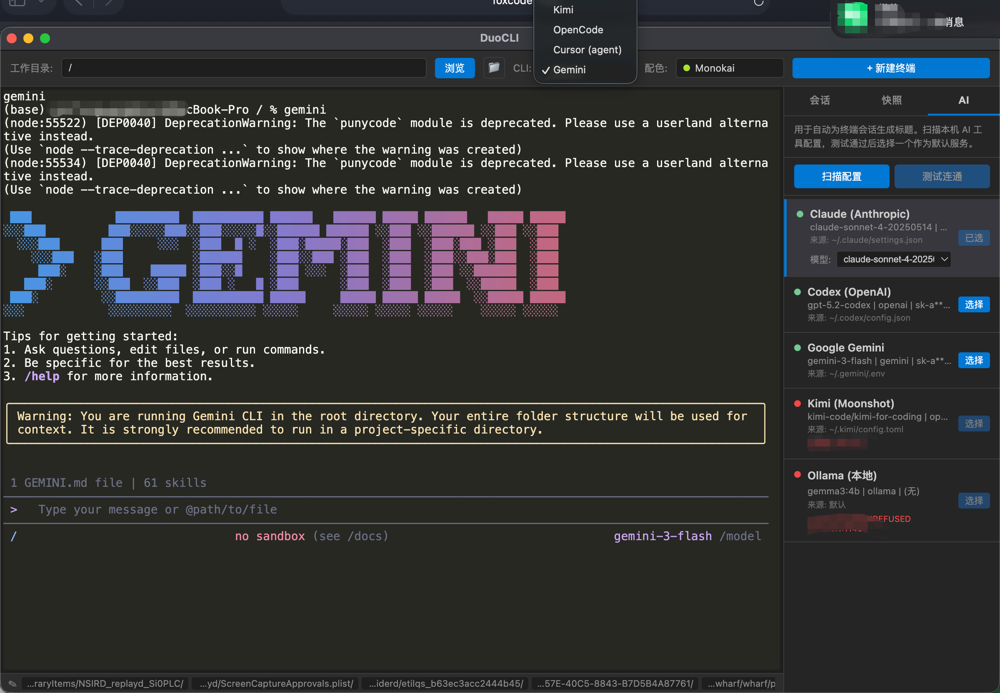
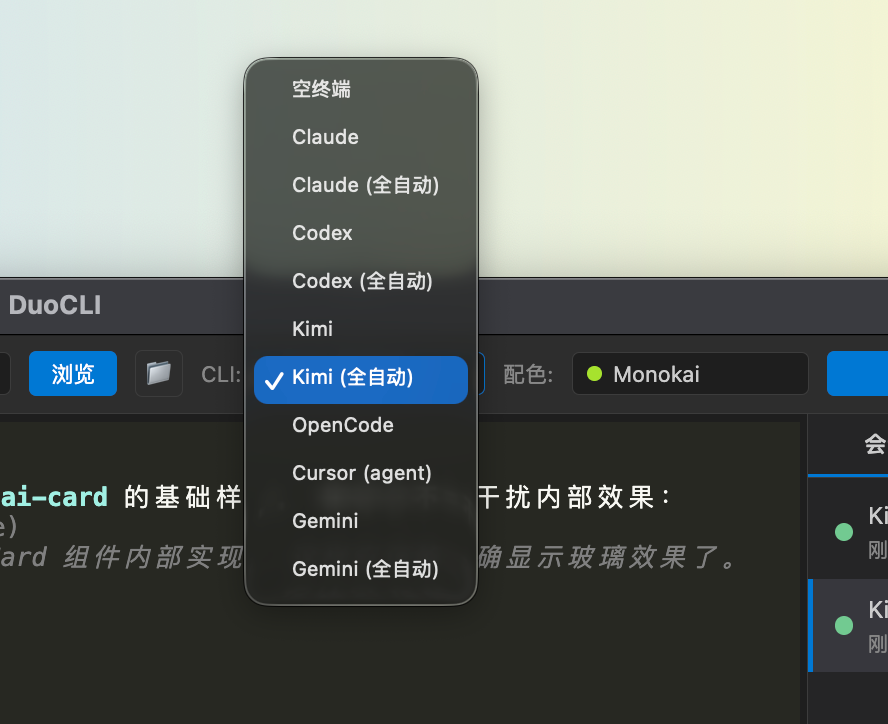
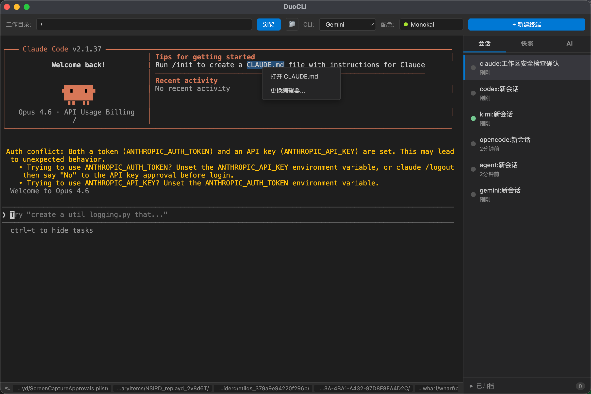

# 都说 Claude Code 厉害，但它真的太难用了

> **DuoCLI — 多开 CLI 神器。** 我被逼得自己写了个工具。

---

## 先吐槽

2026 年了，AI 编程助手满天飞。Claude Code、Codex、Gemini CLI、Kimi、Kiro、Cursor、Antigravity……每个都说自己牛，每个都有点东西，但没有一个让我省心的。

上周被这些工具搞得头大，我来挨个说说。

### Cursor：好用，但又重又贵

Cursor 用着确实最顺手，IDE 集成做得好，改代码体验丝滑。但是——**又重又贵**。IDE 本身就吃资源，包月费用在那摆着，长期用下来是一笔不小的开支。而且没法用自己的 API Key 和模型，只能用它给你的，想换个便宜的或者本地的？不行。

### Claude Code：厉害，但真的难用

都说 Claude Code 是最强的编程 AI，代码质量确实没话说。但它就是一个单独的命令行窗口啊！做大块任务挺好，一个需求扔进去哐哐写。可碎任务呢？改个样式、调个间距、换个颜色，每次都要在终端里折腾半天。

而且终端里的文件路径点不开。AI 说"我改了 `src/components/Header.vue`"，你想看看改了啥——不会用 VIM，路径又点不动，只能自己去资源管理器里一层层翻目录找。**找文件翻目录，这个体验真的太原始了。**

### Codex：Debug 不错，又慢又贵

Codex 的 debug 能力确实可以，定位问题挺准。但是又慢又贵，等它跑完一个任务的时间够我泡杯咖啡了。

### Kiro：有免费羊毛，但不方便

Kiro 有免费额度，薅羊毛还行。但用起来不大方便，总觉得差点意思。

### Kimi：买了包月，不用浪费

Kimi 买了包月，不用白不用。但它跟其他工具之间没法联动，又是一个独立的窗口。

### Antigravity：界面不错，其他不大行

Antigravity 做界面还挺好看的，但除了界面之外的能力就比较一般了。

### OpenCode：太笨，还不如 CLI

OpenCode 想法挺好，但实际用起来太笨了，理解能力和代码质量都差一截，还不如直接用 Claude Code 的命令行。

---

## 然后是终端本身的问题

抛开这些 AI 工具不谈，**终端本身就有一堆让人抓狂的地方：**

**多开麻烦。** 同时用 Claude、Codex、Gemini 三个 AI，就得开三个终端窗口。标签栏全是 "zsh"，切过去完全分不清谁是谁。想新开一个会话？又要重新 cd 到项目目录、重新输命令。

**配色改不了。** 想给不同任务换个颜色区分一下？做不到。三个终端窗口长得一模一样，全是黑底白字。

**图片粘不上。** 这个是最让人崩溃的。微信上有人发了个 bug 截图，或者你自己截了个屏想给 AI 看看——**对不起，终端不支持粘贴图片。** 你得先把图片保存成文件，再手动输入文件路径。2026 年了，Ctrl+V 粘贴个图片都做不到，这合理吗？

**回滚搞不明白。** 让 AI 重构了一个模块，跑起来发现改坏了。想回退？AI 改了十几个文件，你根本记不清改之前是什么样。`git stash`？早就被后面的操作覆盖了。每次回滚都像开盲盒，不知道到底恢复到了哪个状态。

**文件路径点不开。** AI 输出了一堆文件路径，想点开看看？不好意思，这是终端，不是浏览器。不会 VIM 的话，就只能自己去 Finder 里一层层翻。

**YOLO 模式参数记不住。** Claude 的全自动模式要加 `--dangerously-skip-permissions`，Codex 要加 `--full-auto`，Gemini 和 Kimi 要加 `--yolo`……每次都要去翻文档查参数，烦死了。

**API Key 配了又配。** 机器上明明已经配好了 Claude 的 API Key，装了 Codex 也配了一遍，现在又来个新工具还要再配一遍……

---

## 被逼出来的工具

我是个三脚猫程序员，日常就是改点东西、看看效果、不行就回退。被上面这些破事折磨了几个月之后，我决定——**自己写一个，把不爽的地方全改了。**

这就是 DuoCLI。



一句话：**一个为 AI 编程时代设计的多终端管理器。** 不是又一个终端模拟器，而是专门解决「用命令行跑 AI 编程助手」这个场景下的所有痛点。

核心就五个字：**一键搞定一切。**

---

## 它解决了什么

### 一键多开 — 告别窗口地狱

一个窗口管理所有 AI 终端。选好工作目录、选个预设命令、选个配色，点「+ 新建终端」——Claude、Codex、Gemini、Kimi，想开几个开几个，全在一个界面里。

每个终端会根据内容**自动生成中文标题**，比如「Claude:重构登录模块」「Codex:添加单元测试」。不用再对着一排 "zsh" 猜了。

- 内置 6 套配色（VS Code Dark / Monokai / Dracula / Solarized Dark / One Dark / Nord），不同任务不同颜色，一眼区分
- 暂时不用的终端可以「归档」，进程不会被杀掉，随时恢复
- 零配置复用本机已有的 API Key，不用重复配置

### 一键 YOLO — 全自动模式，不用记参数

Claude 的全自动要加 `--dangerously-skip-permissions`（谁记得住这么长的参数？），Codex 要加 `--full-auto`，Gemini 和 Kimi 要加 `--yolo`……

在 DuoCLI 里，下拉菜单直接选就行：



每个 AI 工具都有「普通」和「全自动」两个选项。选「Claude (全自动)」，参数自动帮你加好，一键起飞。再也不用翻文档查参数了。

### 一键贴图 — 终端也能粘贴截图了

**这个功能我觉得是最实用的。**

用终端跑 AI 编程助手，最痛苦的事情之一就是：**没法粘贴图片。** 微信上同事发了个 bug 截图，你想让 AI 看看——不好意思，终端不支持。你得先把图片保存成文件，找个地方存好，再手动输入文件路径给 AI。

DuoCLI 直接解决了这个问题。**Ctrl+V / Cmd+V，直接粘贴。** 从微信复制的截图、系统截屏、浏览器里复制的图片——粘贴进去就行，DuoCLI 会自动保存成临时文件并把路径发给终端。

2026 年了，粘贴个图片本来就不应该这么费劲。

### 一键回滚 — 时间机器，改坏了不怕

这是我最喜欢的功能。

AI 每次修改代码前，DuoCLI 会**自动创建 Git 快照**。你可以：

- 查看每个快照改了哪些文件
- 展开看每个文件的 diff（带颜色高亮）
- **逐文件恢复**——只回滚某一个文件
- **撤销本次变更**——回滚这次快照记录的所有变更文件
- **还原到此时刻**——直接把整个项目恢复到某个快照时的完整状态（时间机器）



已撤销/已还原的快照会显示删除线标记，一眼就能看出哪些历史已经回滚过。

快照存在一个独立的 Git 孤儿分支上（`_duocli_snapshots`），**完全不会污染你的项目提交历史**。三脚猫程序员的救命稻草。

### 一键点链接 — 文件路径直接点开

终端输出中的文件路径会自动变成**可点击的链接**。

不管是绝对路径 `/Users/xxx/src/App.vue`，还是相对路径 `pages/index/index.vue`，甚至 `@/components/Header.vue` 这种别名路径——点击就能直接用编辑器打开。

再也不用去 Finder 里翻目录了。右键点击还能切换默认编辑器。

### 零配置 — API Key 自动发现

DuoCLI 会自动扫描你机器上已有的 AI 工具配置：


`~/.claude`、`~/.codex`、`~/.gemini`、环境变量里的 API Key……全部自动发现，不用重复配置。

点一下「扫描并测试」，自动检测并验证，选一个能用的就行。

---

## 怎么用

### 直接下载

前往 [Releases](https://github.com/saddism/DuoCLI/releases) 下载安装包：

- **macOS** — `.dmg` 文件，打开后拖入 Applications。首次打开如提示"无法验证开发者"，右键点击应用 → 打开即可
- **Windows** — `.exe` 安装包，双击安装。如弹出 SmartScreen 警告，点击"更多信息" → "仍要运行"

### 从源码构建

```bash
git clone https://github.com/saddism/DuoCLI.git
cd DuoCLI
npm install
npm run rebuild
npm start
```

启动后：
1. 选择工作目录
2. 选预设命令（Claude / Codex / Gemini / Kimi / 空白终端，带"全自动"后缀的选项自动附加参数）
3. 选配色
4. 点「+ 新建终端」

就这么简单。

---

## 技术栈

Electron + node-pty + xterm.js + TypeScript + esbuild

整个项目结构很清晰，欢迎 PR。

---

## 最后

这个工具就是被各种不爽逼出来的。

都说 Claude Code 厉害，我也觉得厉害。但厉害归厉害，难用归难用。既然没人解决这些痛点，那就自己动手。

如果你也在同时用多个 AI 编程工具，或者被终端的各种反人类体验折磨过，试试 DuoCLI。

**GitHub:** https://github.com/saddism/DuoCLI

觉得有用的话，给个 Star 吧。反正不要钱。
